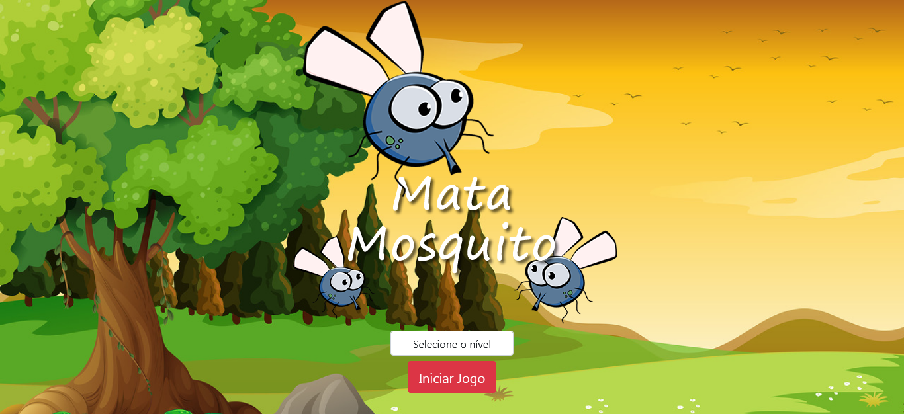
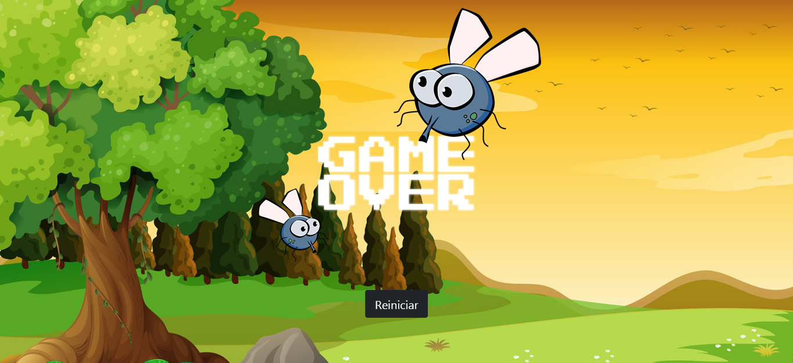

<h1 align="center">
    Aplicativo Mata Mosquito
</h1>

## 📃 Sobre

O aplicativo **Mata Mosquito** é um mini game feito com funções nativas do **Javascript**, de forma simples, para não criar uma codificação muito extensa. Por conta disso, o código contem algumas **más práticas**, porém o objetivo principal foi atingido que era criar um mini game se preocupando apenas com o aprendizado.

O jogo consiste basicamente em matar os **Mosquitos** que aparecem aleatoriamente na página em um periodo de tempo sem perder as 3 vidas, a velocidade que os mosquitos aparecem na tela, depende do nível escolhido pelo usuário, quanto mais alto o nível for, mais rápido o mosquito aparece na tela. Após o término do jogo se o usuário conseguiu terminar com pelo menos 1 vida, ele é redirecionado para a página vitória, agora se ele perdeu todas as vidas ele é redirecionado para a página game over.

--- 

## 📚 Principais aprendizados

- Paradigma procedural
- Formas de utilizar o setInterval
- Importância da DOM

---

## 🚀 Tecnologias utilizadas

O projeto foi desenvolvido com as seguintes tecnologias:

- HTML
- CSS
- JS
- Bootstrap

---

## 📷 Imagens

### Página Inicial

<h1 align="center">
    
</h1>

### Página do Jogo

<h1 align="center">
    
</h1>

### Página Derrota

<h1 align="center">
    
</h1>

### Página Vitória 

<h1 align="center">
    
</h1>

## 📁 Como baixar o projeto

```bash

    # Clonar o repositório
    $ git clone https://github.com/EnzoXavier1001/AppMataMosquito

    # Entrar no diretório
    $ cd AppMataMosquito

```